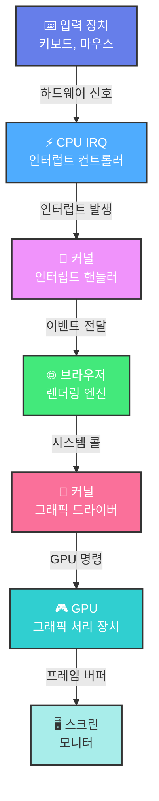

# 화면에 그리기

## 2.1 창 만들기

- 프로그램은 자신의 창을 제어하고 데스크톱 환경은 화면을 제어하는 식으로 역할이 나뉜다.
  - 프로그램이 새 창을 요청하면 데스크톱 환경이 새 창을 표시
  - 프로그램이 해당 창에 특정 요소를 그리면 데스크톱 환경이 이를 화면에 표시
  - 데스크톱 환경은 클릭이나 키 입력을 프로그램에 알려주고, 프로그램은 이를 처리하고 창을 다시 그림

### 🖥️ 입력에서 출력까지의 과정



**1. 입력 장치 (Input Device)**

- 사용자가 키보드를 누르거나 마우스를 클릭하면 전기 신호가 발생
- 예: 키보드에서 'A' 키를 누르면 특정 전압 신호가 만들어짐

**2. CPU - IRQ (Interrupt Request)**

- CPU는 평소에 자기 일을 하다가 입력 장치에서 신호가 오면 "잠깐!"하고 멈춤
- 마치 일하다가 초인종이 울리면 문 열러 가는 것과 비슷
- 이걸 하드웨어 인터럽트라고 부릅니다

**3. 커널 - 인터럽트 핸들러 (Interrupt Handler)**

- CPU가 커널의 특별한 코드(인터럽트 핸들러)를 실행
- 디바이스 드라이버가 "아, 키보드에서 'A'를 눌렀구나!"라고 해석
- 하드웨어 신호를 소프트웨어가 이해할 수 있는 이벤트로 변환

**4. 브라우저 (Application)**

- 커널이 "야, 브라우저! 사용자가 'A' 눌렀어!"라고 알려줘요
- 브라우저는 해당 이벤트를 처리합니다:
  - input 필드에 포커스가 있으면 → 'A' 문자를 해당 요소의 텍스트에 추가
  - JavaScript 이벤트 리스너가 있으면 → 해당 함수 실행
  - **변경된 DOM 요소만** 다시 렌더링
- 커서 위치도 업데이트하고, 필요한 부분만 다시 그릴 준비를 해요

**5. 커널 - 그래픽 드라이버 (Graphics Driver)**

- 브라우저가 "여기에 이렇게 그려줘!"라고 시스템 콜(요청)을 보내요
- 커널의 그래픽 드라이버가 이 요청을 GPU가 이해하는 명령어로 번역합니다

**6. GPU (Graphics Processing Unit)**

- GPU가 실제로 픽셀들을 계산해요 (색깔, 위치, 효과 등)
- 수천 개의 계산을 동시에 병렬로 처리해서 매우 빨라요
- 완성된 이미지를 프레임 버퍼(임시 저장소)에 저장

**7. 스크린 (Monitor)**

- 모니터가 프레임 버퍼에서 데이터를 읽어와 실제 화면에 빛으로 표시해요
- 보통 1초에 60번(60Hz) 또는 144번(144Hz) 새로고침해요

**⚡ 전체 과정은 보통 16ms(1/60초) 이하로 일어나서 거의 즉각적으로 느껴짐!**

- 모바일 기기는 배터리로 작동하고 CPU와 메모리 성능이 현저히 느리고 성능이 떨어지기 때문에 전력효율성이 훨씬 더 중요함, 따라서 GPU 하드웨어를 활용하는 것이 훨씬 중요하며 모바일 브라우저는 훨씬 신경쓸 게 많음

## 2.4 텍스트 스크롤하기

- 페이지의 좌표계와 화면의 좌표계 사이에 레이어 개념이 필요
- 브라우저는 페이지 좌표계로 페이지를 레이아웃하고 난 뒤에 화면 좌표계로 페이지를 렌더링

### 브라우저 렌더링

```
1. Parsing (파싱)
   ↓
2. Render Tree (렌더 트리 생성)
   ↓
3. Layout (레이아웃)
   ↓
4. Paint (페인트)
   ↓
5. Composite (합성 준비)
   ↓
6. Raster (래스터화)
   ↓
7. Draw (화면 출력)
```

#### 1. Parsing (파싱)

**입력**: HTML, CSS 파일

**출력**:

- DOM Tree (문서 구조)
- CSSOM Tree (스타일 규칙)

#### 2. Render Tree (렌더 트리)

**입력**: DOM Tree + CSSOM Tree

**처리**:

- 실제 화면에 표시될 요소만 선택
- `display: none` 제외
- `visibility: hidden` 포함 (공간은 차지함)

**출력**: Render Tree

#### 3. Layout (레이아웃)

**입력**: Render Tree

**처리**: 각 요소의 정확한 위치와 크기 계산

**출력**: Layout Tree

```javascript
{
    element: <div>,
    x: 100,        // 계산된 좌표
    y: 200,
    width: 300,
    height: 150,
    // 박스 모델 정보
}
```

**저장 크기**: 수십 KB

**언제 실행**:

- 요소 크기/위치 변경 시
- 윈도우 리사이즈 시
- DOM 추가/제거 시

#### 4. Paint (페인트)

**입력**: Layout Tree

**처리**:

- Layout에서 계산된 좌표를 읽어옴
- "그리기 명령어"로 기록
- 실제로 그리지는 않음

**출력**: Display List

```javascript
[
  {
    cmd: "drawRect",
    x: 100, // Layout에서 가져온 좌표
    y: 200, // (최종 렌더링 좌표)
    width: 300,
    height: 150,
    color: "blue",
  },
  {
    cmd: "drawText",
    x: 120,
    y: 230,
    text: "Hello",
    font: "16px Arial",
    color: "white",
  },
];
```

**저장 크기**: 수 KB (명령어만)

**중요 특징**:

- ✅ Layout 좌표 포함 (절대 좌표 또는 변환 행렬 형태)
- ❌ 아직 비트맵 아님
- ✅ 캐시되어 재사용 가능

**언제 실행**:

- 색상/배경 변경 시
- 텍스트 내용 변경 시
- Layout 변경 시 (Layout → Paint 순서)

**스크롤 시**: ❌ 실행 안 함 (Display List 재사용)

#### 5. Composite (합성 준비)

**입력**: Display List, Layout Tree

**처리** (여러 세부 작업 포함):

1. **레이어 트리 구성** (Update Layer Tree)
2. **타일 분할** (Tiling Decision)
   - 페이지를 작은 타일로 분할 (일반적으로 256×256 또는 512×512 픽셀)
   - 디바이스와 상황에 따라 크기 다를 수 있음
3. **래스터화 계획** (Raster Scheduling)
   - 어떤 타일을 래스터화할지 결정
   - 보이는 영역 + 버퍼 영역만 선택
4. **Main Thread → Compositor Thread 전달**

**레이어 분리 조건**:

```css
/* 다음과 같은 경우 별도 레이어로 분리 */
.separate-layer {
  transform: translateZ(0); /* 3D transform */
  will-change: transform; /* 변경 예고 */
  position: fixed; /* 고정 위치 */
  /* video, canvas, iframe도 별도 레이어 */
}
```

**출력**:

```javascript
{
    layers: [
        {
            id: 'header',
            displayList: headerDisplayList,
            tiles: [tile1, tile2, ...],
            transform: 'none',
            isFixed: true
        },
        {
            id: 'content',
            displayList: contentDisplayList,
            tiles: [tile3, tile4, ...],
            transform: 'translateY(500px)',
            isScrollable: true
        }
    ],
    tilesToRaster: [tile3, tile4, tile7]  // 보이는 영역 타일
}
```

**중요 특징**:

- ❌ 아직 비트맵 없음
- ✅ "계획"만 수립
- ✅ Main Thread → Compositor Thread로 전달

**스크롤 시**: ✅ 실행 (새로운 타일 계획 수립)

#### 6. Raster (래스터화)

**입력**: Display List, 타일 정보

**처리**: Display List 명령어를 **실제로 재생(playback)**하여 비트맵 생성

**래스터화 방식**:

1. **GPU Rasterization** (현대 브라우저 기본)
   - Display List를 GPU로 직접 전송
   - GPU에서 비트맵 생성
2. **Software Rasterization** (폴백)
   - CPU에서 비트맵 생성
   - 생성된 비트맵을 GPU에 업로드

**출력**: Bitmap (비트맵)

**저장 위치**: GPU 메모리 (VRAM)

**처리 방식**:

- 별도의 Raster Thread(s)에서 병렬 처리
- 보이는 영역 + 버퍼 영역만 래스터화
- 타일 단위로 처리

**중요 특징**:

- ✅ **실제 픽셀 생성!**
- ✅ Display List를 "재생(playback)"하는 단계
- ✅ 타일 기반으로 처리하여 메모리 효율적

**스크롤 시**: ✅ 실행 (새로 보이는 타일만 래스터화)

#### 7. Draw (화면 출력)

**입력**: GPU 메모리의 비트맵(텍스처)들

**처리**:

1. **Composite**: 모든 타일/레이어를 GPU로 합성
2. **Submit**: 최종 이미지를 프레임버퍼로 전송
3. **Present**: 모니터로 출력

**처리 시간**: ~0.1ms (매우 빠름)

**특징**:

- GPU의 병렬 처리 능력 활용
- 60Hz (또는 120Hz, 144Hz) 모니터 주사율에 맞춰 출력
- vsync로 동기화하여 찢어짐(tearing) 방지

**스크롤 시**: ✅ 실행 (매 프레임마다)

#### 스레드 구조

```
Main Thread:
├─ Parsing
├─ Render Tree
├─ Layout
├─ Paint (Display List 생성)
└─ Commit → Compositor Thread로 전달

Compositor Thread:
├─ Composite (타일링 계획)
├─ Raster 작업 스케줄링
│   ├─→ Raster Thread 1 (병렬 처리)
│   ├─→ Raster Thread 2
│   └─→ Raster Thread 3
├─ Activate (모든 래스터 완료 대기)
└─ Draw (GPU 합성 및 출력)
```

#### 스크롤 시나리오 (최적화된 경우)

```
스크롤 이벤트
    ↓
┌─────────────────────────┐
│ Layout: SKIP ❌         │
│ (위치/크기 변경 없음)     │
└─────────────────────────┘
    ↓
┌─────────────────────────┐
│ Paint: SKIP ❌          │
│ (Display List 재사용)    │
└─────────────────────────┘
    ↓
┌─────────────────────────┐
│ Composite: 실행 ✅      │
│ - 새 타일 계획 수립       │
│ - 레이어 위치 업데이트    │
│ 시간: ~0.5ms            │
└─────────────────────────┘
    ↓
┌─────────────────────────┐
│ Raster: 실행 ✅         │
│ - 새로 보이는 타일만      │
│ - 캐시된 Display List 재생│
│ 시간: ~1-3ms            │
└─────────────────────────┘
    ↓
┌─────────────────────────┐
│ Draw: 실행 ✅           │
│ - GPU 합성 및 출력       │
│ 시간: ~0.1ms            │
└─────────────────────────┘

```

#### Display List의 역할

1. **Layout 좌표를 포함**: 최종 렌더링 좌표 (절대 좌표 또는 변환 행렬 형태)
2. **명령어 형태로 저장**: `drawRect`, `drawText`, `drawImage` 등
3. **Paint 단계에서 생성**: Layout Tree를 읽어서 명령어로 기록
4. **Raster 단계에서 재생**: 명령어를 실행하여 비트맵으로 변환
5. **재사용 가능**: 캐시되어 스크롤 시 재사용
6. **메모리 효율적**: 비트맵보다 100배 이상 작음 (수 KB vs 수 MB)

#### 디스플레이 리스트를 저장하는 것이 왜 빠른가?

✅ **Display List 재사용**: Layout/Paint 건너뜀 (8-10ms 절약)  
✅ **타일 기반 렌더링**: 필요한 부분만 래스터화  
✅ **GPU 병렬 처리**: 수천 개 코어로 동시에 처리  
✅ **별도 스레드**: Main Thread 블로킹 없음  
✅ **레이어 분리**: 변경된 레이어만 다시 렌더링

**스크롤이 빠른 이유**:

- Display List를 재사용 (Layout/Paint 스킵)
- 새로 보이는 타일만 래스터화
- GPU의 엄청난 병렬 처리 능력
