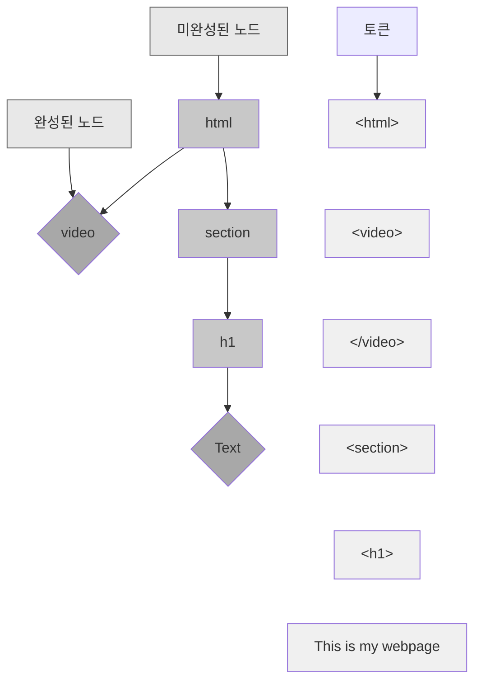

# 문서 트리 구축하기

## 4.1 노드 트리

- HTML 트리는 태그 쌍(여는 태그, 닫는 태그)을 위한 노드와 텍스트 스팬을 위한 노드를 갖는다.
- 트리를 사용하려면 토큰을 노드로 변경해야한다. 즉, 자식 노드들의 리스트와 부모 노드에 대한 포인터를 추가해야 한다는 의미
- 소스 코드로 부터 노드 트리를 구성하는 것을 파싱이라하며, 파서는 한 번에 하나의 엘리먼트나 텍스트 노드를 추가하면서 트리를 구축
  - 파서가 파싱을 진행하는 동안 불완전한 트리를 저장해야 함을 의미

### HTML 일부 파싱 시 완성된 태그와 미완성 태그



- 파서는 HTML 문서를 순서대로 읽기 때문에 미완성 태그는 트리 어딘가에 늘 존재할 수 있다.
- 미완성 태그는 항상 열려있지만 아직 닫히지 않았고, 완성된 노드보다 소스에서 항상 뒤에 나오고, 항상 다른 미완성 태그의 자식 노드다.

## 4.2 트리 구축하기

좋습니다! 예측 파서가 **부분적으로 문제를 완화한 것**을 명확히 반영하겠습니다.

---

### `document.write()`: 사용 금지 권고

`document.write()`는 HTML 문서에 직접 콘텐츠를 작성하는 JavaScript 메서드입니다. HTML 스펙과 MDN에서 **Deprecated**로 지정되었으며, 사용을 강력히 권장하지 않습니다.

#### 핵심 문제: 파싱 중 문서 수정

브라우저가 HTML을 읽는 도중에 그 내용을 바꿀 수 있다는 근본적인 설계 결함을 가지고 있습니다.

#### 예측 파서를 통한 부분적 개선

브라우저는 `document.write()`의 성능 문제를 완화하기 위해 **예측 파서(Speculative Parser)**를 도입했습니다.

**작동 방식:**

```javascript
<script>
  // 메인 파서: 스크립트 실행으로 블로킹됨 ⏸️
  document.write('<div>내용</div>');
</script>
      // 예측 파서: 미리 발견!
<link href="style.css">    // 예측 파서: 미리 다운로드 시작 ⚡
<script src="app.js"></script>
```

**개선 효과:**

- 메인 파서가 `document.write()` 실행으로 멈춰 있는 동안
- 예측 파서가 뒤쪽 HTML을 미리 스캔
- 이미지, CSS, 스크립트 등 리소스를 **백그라운드에서 선행 다운로드**
- **리소스 로딩 시간 단축** ✓

이는 `document.write()`로 인한 **네트워크 대기 시간을 크게 개선**했습니다.

#### 여전히 남은 문제들

예측 파서의 개선에도 불구하고 근본적인 문제는 해결되지 않았습니다:

**1. 예측의 무효화**

```javascript
<script>
  // 예측 파서가 아래 cat.jpg를 발견하고 다운로드 시작
</script>


<script>
  document.write(''); // HTML이 바뀜!
  // 예측 파서가 본 내용이 무효화될 수 있음
</script>
```

브라우저는 안전을 위해 `document.write()`가 있으면 일부 최적화를 포기해야 합니다.

**2. 메인 파서 블로킹은 여전**

- 리소스는 미리 다운로드되지만
- **DOM 구축은 여전히 멈춤**
- 렌더링 시작이 지연됨

**3. 파싱 시점에 따른 이상 동작**

- **파싱 중**: 메인 파서 블로킹
- **로드 완료 후**: `document.open()` 자동 호출로 전체 문서 삭제

**4. 예측 불가능한 파서 상태 변경**

```javascript
document.write("<plaintext>"); // 이후 모든 것이 텍스트로 처리
document.write("<!--"); // 주석 모드 진입
```

**5. 비동기 환경 미지원**

- `async`/`defer` 스크립트에서 무시되고 에러 발생
- XML/XHTML에서 `InvalidStateError` 예외

**6. XSS 보안 취약점**

```javascript
document.write(userInput); // 사용자 입력 직접 삽입 → XSS 위험
```

**7. 브라우저의 강제 개입**
Chrome은 느린 네트워크(2G/3G)에서 `document.write()`로 삽입된 외부 스크립트를 **자동 차단**합니다.

#### 현대적 대안

```javascript
// ❌ 사용 금지
document.write("<div>내용</div>");

// ✅ 권장 방식
element.insertAdjacentHTML("beforeend", "<div>내용</div>");

const div = document.createElement("div");
div.textContent = "내용";
parent.appendChild(div);

// 스크립트 동적 로딩
const script = document.createElement("script");
script.src = "app.js";
script.async = true;
document.head.appendChild(script);
```

**보안이 중요한 경우:**

- `textContent` 사용 (HTML 파싱 안 함)
- Trusted Types API 활용
- 프레임워크(React, Vue 등)의 템플릿 시스템 사용

## 4.3 파서 디버깅하기

## 4.4 셀프 클로징 태그

## 4.5 노드 트리 사용하기

## 4.6 페이지 오류 다루기

HTML 암시적 태그는 HTML 문서에서 **명시적으로 작성하지 않아도 브라우저가 자동으로 생성하는 태그**

### 주요 암시적 태그

#### 1. **`<html>`, `<head>`, `<body>`**

```html
<!DOCTYPE html>
<title>제목</title>
<h1>안녕하세요</h1>
```

위 코드는 브라우저가 다음과 같이 해석합니다:

```html
<!DOCTYPE html>
<html>
  <head>
    <title>제목</title>
  </head>
  <body>
    <h1>안녕하세요</h1>
  </body>
</html>
```

#### 2. **`<tbody>`**

테이블에서 `<tr>`을 바로 작성하면 자동으로 `<tbody>`가 생성

```html
<table>
  <tr>
    <td>데이터</td>
  </tr>
</table>
```

→ 브라우저는 `<tbody>`로 감싸서 해석합니다.

#### 3. **`<p>` 자동 종료**

```html
<p>첫 번째 단락</p>
<p>두 번째 단락</p>
```

→ 첫 번째 `<p>` 태그가 자동으로 닫힙니다.

#### 주의사항

- **명시적으로 작성하는 것이 권장됩니다** - 코드의 가독성과 유지보수성을 위해
- **JavaScript DOM 조작 시** - 암시적 태그를 고려하지 않으면 예상치 못한 결과가 발생할 수 있습니다
- **유효성 검사** - W3C 검사 도구는 누락된 태그를 경고할 수 있습니다

브라우저의 이런 "관대한" 파싱은 개발자의 실수를 보완해주지만, 정확한 HTML 작성 습관을 갖는 것이 중요

---

**브라우저 마다 무엇이 옳은 지 추축하는 것보다 모든 브라우저가 같은 결과로 수행하는 것이 더 종요**
