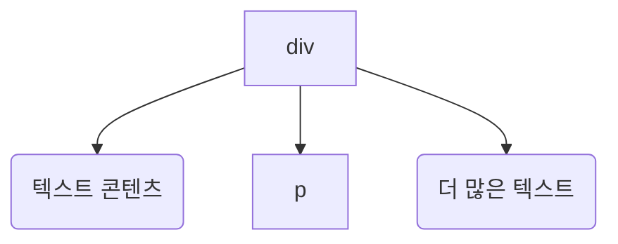
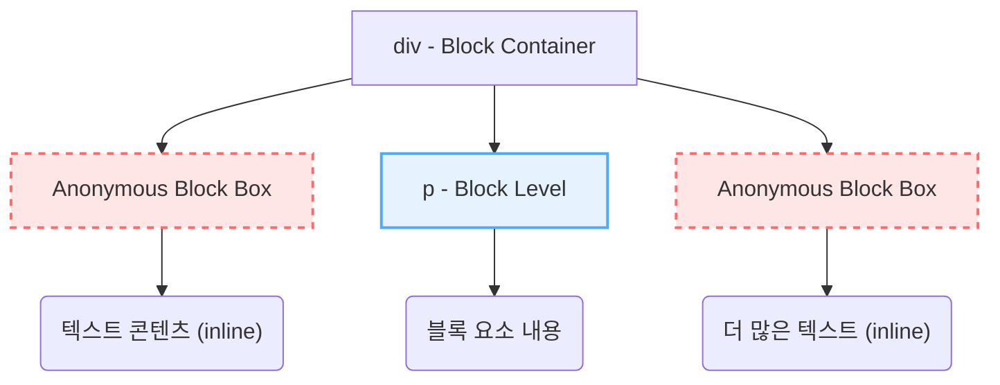

# 페이지 레이아웃

## 5.1 레이아웃 트리

- 브라우저에서 레이아웃은 레이아웃 트리를 만드는 것으로 레이아웃 트리의 각 노드들은 HTML 엘리먼트와 연결되어 있고 각각 크기와 위치를 갖는 레이아웃 오브젝트

## 5.2 블록 레이아웃

### 어나니머스 블록 박스 (Anonymous Block Box)

브라우저의 어나니머스 블록 박스는 CSS 렌더링 과정에서 자동으로 생성되는 박스 모델입니다. 명시적으로 정의되지 않았지만, 레이아웃 규칙을 일관되게 적용하고 예측 가능한 렌더링 결과를 만들기 위해 브라우저가 필요에 따라 생성하는 내부 메커니즘입니다.

#### 생성되는 경우

어나니머스 블록 박스는 주로 다음과 같은 상황에서 생성됩니다:

**1. 블록 요소 내부에 인라인과 블록 콘텐츠가 혼재할 때**

```html
<div>
  텍스트 콘텐츠 (인라인)
  <p>블록 요소</p>
  더 많은 텍스트 (인라인)
</div>
```

이 경우 브라우저는 `<div>`의 **직계 자식**인 "텍스트 콘텐츠"와 "더 많은 텍스트"를 감싸는 어나니머스 블록 박스를 자동으로 생성합니다. 이는 블록 컨테이너의 모든 직계 자식은 블록 레벨 박스이거나, 모든 직계 자식은 인라인 레벨 박스여야 한다는 CSS 규칙을 준수하기 위함입니다.

**원본 DOM 구조:**



<br>

**어나니머스 블록 박스 생성 후 (렌더 트리):**



**2. 인라인 요소 내부에 블록 요소가 있을 때 (W3C 명세상 잘못된 HTML 구조)**

```html
<span>
  인라인 텍스트
  <div>블록 요소</div>
  더 많은 인라인
</span>
```

이 경우는 HTML 명세상 유효하지 않은 구조이지만, 브라우저는 오류 복구(error recovery) 메커니즘을 통해 최대한 렌더링을 시도합니다. 이 과정에서 `<span>`이 분할되거나 `<div>`가 `<span>`을 벗어난 블록으로 처리되며, 이때 `<div>`를 감싸는 어나니머스 블록 박스가 생성될 수 있습니다.

**3. `display: flex` 또는 `display: grid` 컨테이너의 자식으로 텍스트 노드가 직접 있을 때**

```html
<div style="display: flex;">
  텍스트 콘텐츠
  <span>인라인 요소</span>
</div>
```

Flexbox나 Grid 컨테이너의 직계 자식은 Flex/Grid 아이템이어야 합니다. "텍스트 콘텐츠"는 직접적으로 Flex/Grid 아이템이 될 수 없으므로, 브라우저는 이를 감싸는 **익명 Flex 아이템(Anonymous Flex Item)** 또는 **익명 Grid 아이템(Anonymous Grid Item)**을 생성합니다. 이는 어나니머스 블록 박스의 특수한 형태로 볼 수 있습니다.

**4. 테이블 관련 `display` 속성에서 구조가 불완전할 때**

```html
<div style="display: table;">
  일반 텍스트
  <div style="display: table-row;">
    <div style="display: table-cell;">셀 내용</div>
  </div>
</div>
```

CSS 테이블 모델에서 `display: table`은 직계 자식으로 `table-row-group`, `table-header-group`, `table-footer-group`, 또는 `table-row`를 기대합니다. "일반 텍스트"와 같은 예상치 못한 콘텐츠가 있을 경우, 브라우저는 익명 테이블 관련 박스들을 생성하여 올바른 테이블 구조를 복구합니다.

**5. 익명 인라인 박스 (Anonymous Inline Box)**

블록 박스뿐만 아니라, 인라인 컨텍스트에서도 익명 박스가 생성됩니다:

```html
<p>일반 텍스트 <em>강조 텍스트</em> 더 많은 텍스트</p>
```

"일반 텍스트"와 "더 많은 텍스트"는 별도의 HTML 요소로 감싸지지 않았지만, 렌더링 과정에서 **익명 인라인 박스(Anonymous Inline Box)**로 처리됩니다. 이를 통해 모든 인라인 콘텐츠가 일관된 박스 모델 내에서 처리됩니다.

#### 생성 및 복구 메커니즘의 동작 원리

브라우저는 다음과 같은 단계로 어나니머스 박스를 처리합니다:

**1. 트리 구조 분석 (DOM 트리 → 렌더 트리)**

- DOM 트리를 순회하여 **렌더 트리(또는 레이아웃 트리)**를 생성하는 과정에서, CSS 속성(`display` 등)을 기반으로 블록/인라인 레벨 혼재 상황을 감지합니다.
- 특히, 블록 컨테이너가 직접 인라인 레벨 박스(텍스트 노드나 `<span>` 등)와 블록 레벨 박스(`<p>`, `<div>` 등)를 동시에 포함할 수 없다는 CSS 규칙을 준수하기 위해 작동합니다.

**2. 자동 박스 생성 및 복구**

- 필요한 위치에 **익명 블록 박스(Anonymous Block Box)** 또는 **익명 인라인 박스(Anonymous Inline Box)**를 삽입하여 일관된 박스 모델을 유지합니다.
- 인접한 인라인 콘텐츠(텍스트 노드 포함)들을 하나의 어나니머스 블록 박스로 그룹화하여, 모든 블록 컨테이너의 자식이 블록 레벨 박스이거나 모든 자식이 인라인 레벨 박스 중 하나가 되도록 **구조를 복구**합니다.
- 잘못된 HTML 구조나 예상치 못한 콘텐츠 배치가 있어도 브라우저가 자동으로 레이아웃 규칙에 맞게 조정합니다.

**3. 스타일 상속**

- 어나니머스 박스는 **부모 요소로부터 상속 가능한 속성들(예: `font-size`, `color`, `line-height`, `text-align` 등)**을 상속받습니다.
- 직접 스타일 지정은 불가능합니다 (선택자로 접근 불가).

**4. 레이아웃 계산**

- 일반 블록 박스와 동일하거나 유사한 레이아웃 규칙이 적용됩니다.
- 수직 마진 병합(Margin Collapsing), 너비 계산, 높이 계산 등이 이루어집니다.

#### 주요 특징

- **선택 불가능**: CSS 선택자로 직접 타겟팅하거나 스타일을 적용할 수 없습니다. (예: `div > *`와 같은 자식 선택자로도 접근 불가)
- **자동 생성**: 개발자가 명시하지 않아도 브라우저가 CSS 렌더링 규칙을 지키기 위해 자동으로 생성합니다.
- **일관성 보장**: CSS 박스 모델의 규칙을 위반하지 않고, 모든 요소를 일관된 흐름(블록 포맷팅 컨텍스트 또는 인라인 포맷팅 컨텍스트) 내에 두어 렌더링의 예측 가능성을 보장합니다.
- **상속만 가능**: 부모로부터 상속되는 속성(Inherited Properties)만 적용되며, 자체적으로 CSS 속성을 가질 수 없습니다.
- **디버깅 어려움**: 개발자 도구에서도 명시적으로 "어나니머스 블록 박스"로 표시되지 않는 경우가 많아, 존재를 파악하기 어려울 수 있습니다. (일반적으로 텍스트 노드로 표시되거나, 특정 컨텍스트에서만 식별 가능)

💡 **디버깅 팁:** Chrome DevTools의 Computed 탭에서 Layout 정보를 확인하거나, 각 요소의 Box Model을 검사하면 어나니머스 박스의 영향을 간접적으로 파악할 수 있습니다. Elements 패널에서 텍스트 노드를 선택하고 스타일이 어떻게 상속되는지 확인하는 것도 도움이 됩니다.

#### 실용적 의미

이 메커니즘 덕분에 개발자는 HTML 구조가 완벽하지 않거나 의도치 않게 혼합된 콘텐츠를 작성했을 때도 브라우저가 합리적이고 일관된 렌더링 결과를 만들어냅니다. 즉, 브라우저가 CSS 규칙에 맞춰 **레이아웃 구조를 스스로 "복구"하고 정돈**하는 과정의 핵심입니다.

하지만 예측 가능하고 제어 가능한 레이아웃을 위해서는 HTML과 CSS 명세에 따라 블록과 인라인 요소를 명확히 구분하여 사용하는 것이 가장 좋습니다. 특히 프로덕션 코드에서는 어나니머스 박스 생성에 의존하기보다는, 명시적으로 구조를 정의하여 크로스 브라우저 호환성과 유지보수성을 높이는 것이 권장됩니다.

**참고 자료:**

- [CSS 2.2 Specification: 9.2.1.1 Anonymous block boxes](https://www.w3.org/TR/CSS22/visuren.html#anonymous-block-level)
- [MDN Web Docs: Visual formatting model](https://developer.mozilla.org/en-US/docs/Web/CSS/CSS_display/Visual_formatting_model#anonymous_boxes)

## 5.3 크기와 위치

[width/height 계산](bonus-notes/calculate-layout.md)

**1. 블록 모드 (Block Mode):**

- **Width 계산:** 부모 엘리먼트에서 자식 엘리먼트로 `width`가 즉시 전달 (하향식, Top-down)
- **Height 계산:** 자식 엘리먼트들의 `height`가 계산된 후 부모 엘리먼트로 합산되어 전달 (상향식, Bottom-up)
- **계산 순서:** 깊이 우선 탐색(DFS) 방식으로, 형제 노드로 넘어가기 전에 한 자식 노드의 모든 하위 트리를 완전히 처리
- **CSS와 높이:** `font-size × line-height`로 각 블록의 높이가 결정 (예: `16px × 1.25 = 20px`)

**2. 인라인 모드 (Inline Mode):**

- **Width 계산:** 부모의 `width`는 텍스트가 줄바꿈되는 기준선으로 사용 (하향식)
- **Height 계산:** `width`에 맞춰 텍스트가 여러 줄로 나뉘고, 각 줄에서 가장 큰 `font-size`를 기준으로 `line-height`를 적용하여 줄 높이가 계산됩니다. 이 줄 높이들이 누적되어 최종 `height`가 결정 (상향식)
- **계산 순서:** 재귀 호출 없이 텍스트를 순차적으로 배치하며 계산
- **CSS와 높이:** 각 줄에서 가장 큰 `font-size × line-height`로 해당 줄의 높이가 결정 (예: `20px (bold) × 1.25 = 25px`)

**정리:**

- **Width:** 부모에서 자식으로 즉시 전달되어 레이아웃의 기준이 됩니다.
- **Height:** 자식 또는 인라인 요소들의 콘텐츠에 따라 계산되어 부모로 집계됩니다.
- **계산 방식:** 블록 모드는 깊이 우선 탐색, 인라인 모드는 순차적인 텍스트 배치 방식을 따릅니다.

## 5.4 재귀 페인팅

## 5.5 배경 그리기
